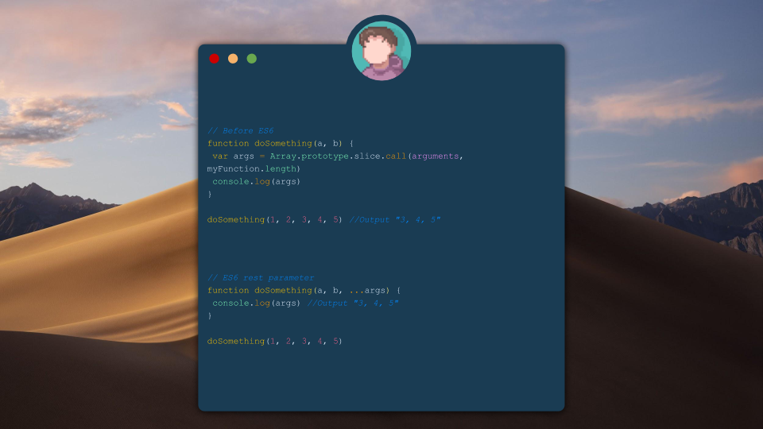

# The rest parameter

The rest parameter is also represented by the " ... " token. The last parameter of a function prefixed with " ... " is called as a rest parameter. The rest parameter is an array type, which contains the rest of the parameters of a function when number of arguments exceeds the number of named parameters.
The rest parameter is used to capture a variable number of the function arguments from within a function.

Before ES6, the programmers used the arguments object of a function to retrieve the  extra arguments, passed to the function. The arguments object is not an array, but it provides some interfaces that are similar to an array.

```javascript
// Before ES6
function doSomething(a, b) {
  var args = Array.prototype.slice.call(arguments, myFunction.length)
  console.log(args)
}

doSomething(1, 2, 3, 4, 5) //Output "3, 4, 5"
```

In ES6, this can be done in a much easier and cleaner way, using the rest parameter.

```javascript
// ES6 rest parameter
function doSomething(a, b, ...args) {
  console.log(args) //Output "3, 4, 5"
}

doSomething(1, 2, 3, 4, 5)
```

The arguments object is not an array object. Therefore, to do array operations on the arguments object, you need to first convert it to an array. As the ES6 rest parameter is an array type, it's easier to work with it.

