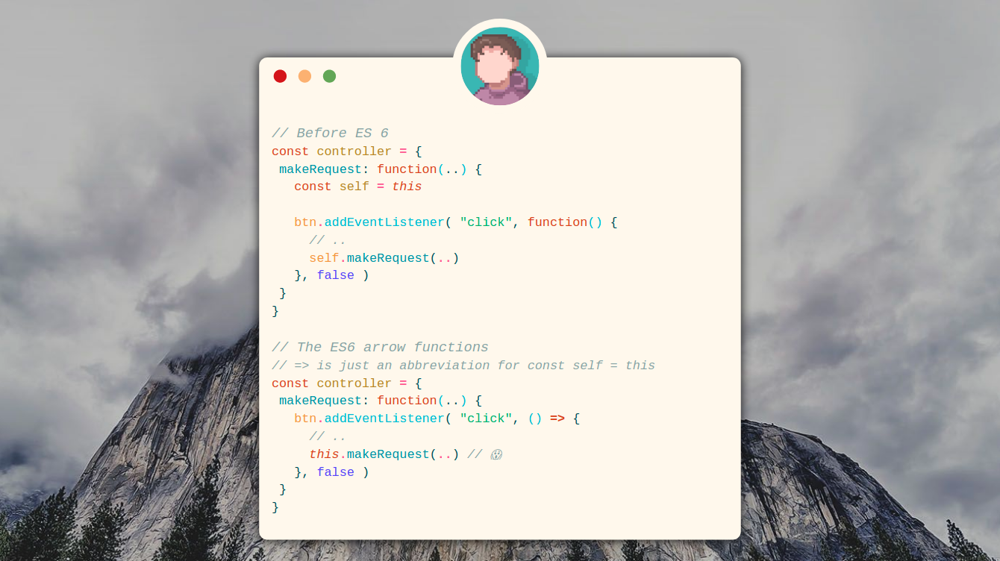

# The arrow functions

ES6 provides a new way to create functions using the => operator. These functions are called as arrow functions. This new method has a shorter syntax, and the arrow functions are the anonymous functions

```javascript
let circleArea = (pi, r) => {
  let area = pi * r * r
  return area
}

let result = circleArea(3.14, 3)

console.log(result) // 28.25999999999
```

If an arrow function contains just one statement, then you don't have to use the `{}` brackets to wrap the code. When `{}` brackets are not used then the value of the statement in the body is automatically returned.

```javascript
let circleArea = (pi, r) => pi * r * r
let result = circleArea(3.14, 3)
console.log(result) // 28.25999999999
```

Here's some arrow function variations to consider:

```javascript
const f1 = () => 12
const f2 = x => x * 2
const f3 = (x, y) => x + y
const f4 = (x, y) => {
  let z = x * 2 + y
  y++
  x *= 3
  return (x + y + z) / 2
}
```

## The value of "this" in an arrow function

In the arrow functions, also called “**fat arrow**” functions the value of this keyword is same as the value of `this` keyword of the enclosing scope (the global or function scope, inside whichever the arrow function is defined), instead of referring to the context object (that is, the object inside of which the function is a property), which is the value of this in traditional functions.


```javascript
const object = {
  f1: function() {
    console.log(this) // Object
    const f2 = function(){ console.log(this) }
    f2() // Window
    setTimeout(f2, 1000) // Window
  }
}

object.f1();
```

Here, this inside the `f1` function refers to object, as f1 is the property of it. `this` inside `f2` refers to the window object, as `f2` is a property of the window object. But this behaves differently in the arrow functions. Let's replace the traditional functions with the arrow functions in the preceding code and see the value of this:

```javascript
const object = {
  f1: () => {
    console.log(this) // Window
    const f2 = () => { console.log(this) }
    f2() // Window
    setTimeout(f2, 1000) // Window
  }
}

object.f1();
```

Here, this inside the `f1` function copies the this value of global scope, as `f1` lies in global scope. this inside `f2` copies the this value of `f1`, as `f2` lies in the `f1` scope.

Now take a look to another example:

```javascript
const controller = {
  makeRequest: function(..) {
    const self = this

    btn.addEventListener( "click", function() {
      // ..
      self.makeRequest(..)
    }, false )
  }
}
```

We used the `const self = this` hack, and then referenced `self.makeRequest(..)`, because inside the callback function we're passing to `addEventListener(..)`, the `this` binding will not be the same as it is in `makeRequest(..)` itself. In other words, because this bindings are dynamic, we fall back to the predictability of lexical scope via the `self` variable.

We finally can see the primary design characteristic of `=>` arrow functions. Inside arrow functions, the `this` binding is not dynamic, but is instead lexical. In the previous snippet, if we used an arrow function for the callback, this will be predictably what we wanted it to be.

```javascript
// => is just an abbreviation for const self = this
const controller = {
  makeRequest: function(..) {
    btn.addEventListener( "click", () => {
      // ..
      this.makeRequest(..) // 😱
    }, false )
  }
}
```

Lexical `this` in the arrow function callback in the previous snippet now points to the same value as in the enclosing `makeRequest(..)` function. In other words, `=>` is just a syntactic abbreviation for `const self = this`. In cases where `const self = this` (or, alternatively, a function `.bind(this)` call) would normally be helpful, `=>` arrow functions are a nicer alternative operating on the same principle.

## Other differences between the arrow and traditional functions

The arrow functions cannot be used as object constructors that is, the new operator cannot be applied on them.

Apart from syntax, the this value, and the new operator, everything else is the same between the arrow and traditional functions, that is, they both are the instances of the Function constructor.


